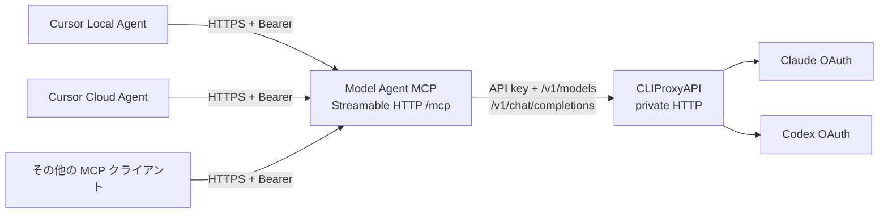

# アーキテクチャ

この MCP は **モデルに実装相談を送る汎用サービス**です。Cursor Local Agent と Cursor Cloud Agent は最初の利用先ですが、Streamable HTTP と Bearer ヘッダーを送れるほかの MCP クライアントからも同じツールを呼べます。Cursor 固有のルールと設定は接続先側に置きます。

## 境界とデータの流れ

| 層 | 担当 | 現行実装 |
| --- | --- | --- |
| 呼び出し元 MCP クライアント | 要件と repo context の収集、提案の評価、編集、テスト、git | この repo の外。Cursor はその具体例 |
| Model Agent MCP | Bearer 認証、MCP ツール、モデル選択、会話履歴、キャンセル | [`src/http.ts`](../src/http.ts)、[`src/mcp.ts`](../src/mcp.ts)、[`src/session-service.ts`](../src/session-service.ts) |
| CLIProxyAPI client | モデル一覧、非ストリーミング chat completion、タイムアウト、応答の検証 | [`src/proxy-client.ts`](../src/proxy-client.ts) |
| CLIProxyAPI | OAuth 認証情報とモデルへのルーティング | 別サービス。設定例は [`compose.yaml`](../compose.yaml) |

モデルの出力は実装案・パッチ案です。MCP サーバーはファイルシステムや git のツールを公開せず、実装を適用しません。モデルに渡る repo 情報は呼び出し元が `context` に含めたものと、それまでの同一セッションの会話テキストに限ります。関連情報を渡さなければ、モデルが repo の事実を確認することはできません。

## 1 回の依頼

1. クライアントが `agent_start_task({task, context?, model?})` を呼びます。
2. MCP は UUID のアプリケーションセッションを作り、既定または指定モデルを選びます。
3. MCP は指示文、提供された context、ユーザーメッセージを CLIProxyAPI の `POST /v1/chat/completions` に送ります。
4. テキスト応答を履歴に追加し、`session_id` と応答をクライアントへ返します。
5. 後続の `agent_continue_task` は保存済みの会話を再送します。`agent_set_session_model` は次の呼び出しからモデル ID を変えます。

[`src/proxy-client.ts`](../src/proxy-client.ts) は Claude 専用の `/v1/messages` ではなく、Claude と Codex/GPT を同じクライアント層で扱うために OpenAI 互換の chat endpoint を使います。モデルが `/v1/models` に表示されても、そのモデルへの chat completion が成功するとは限りません。資格情報、クォータ、ルーティングとモデルの対応を実際の呼び出しで確かめてください。[CLIProxyAPI README](https://github.com/router-for-me/CLIProxyAPI)。

## 二種類の「セッション」

MCP transport は SDK v2 の `createMcpHandler` がリクエストごとに新しいサーバーを作るステートレスな Streamable HTTP です。SDK が対応する transport セッションと、ツールが返す `session_id` は別です。この PoC が保持するのは後者の **アプリケーション会話セッション**です。

[`SessionStore`](../src/session-store.ts) は `get` / `put` のインターフェースを持ち、現在は `MemorySessionStore` を使います。状態は `running`、`ready`、`error`、`cancelled` です。再起動すると会話は消えます。Redis 等に差し替えるときは保存先だけでなく、同一セッションの排他とキャンセル通知も複数インスタンス間で共有する必要があります。

## 認証とネットワーク

認証は二段階です。

1. **クライアント → MCP:** `MCP_BEARER_TOKEN` を `Authorization: Bearer ...` で送ります。`/mcp` の全 HTTP メソッドで検査します。`/healthz` は認証なしの疎通確認です。
2. **MCP → CLIProxyAPI:** `CLIPROXY_API_KEY` を Bearer で送ります。OAuth のログイン・更新は CLIProxyAPI 側の責務です。

本番相当では HTTPS 入口だけを公開し、CLIProxyAPI と OAuth callback ポートは外部へ直接公開しません。Compose 例は両サービスのポートを `127.0.0.1` に bind します。Cloud Agent の HTTP MCP 呼び出しは Cursor のバックエンドを通り、認証ヘッダーを Cloud Agent VM に渡さないと公式文書に記されています。[Cursor Cloud Agent MCP](https://cursor.com/docs/cloud-agent/capabilities)。ほかの MCP クライアントの資格情報管理は各クライアントの仕様を確認してください。

単一の Bearer token を共有する利用者は、知っている `session_id` にアクセスできます。ユーザーごとの権限分離、レート制限、永続履歴は未実装です。[検証状況と制約](verification.md) を参照してください。
